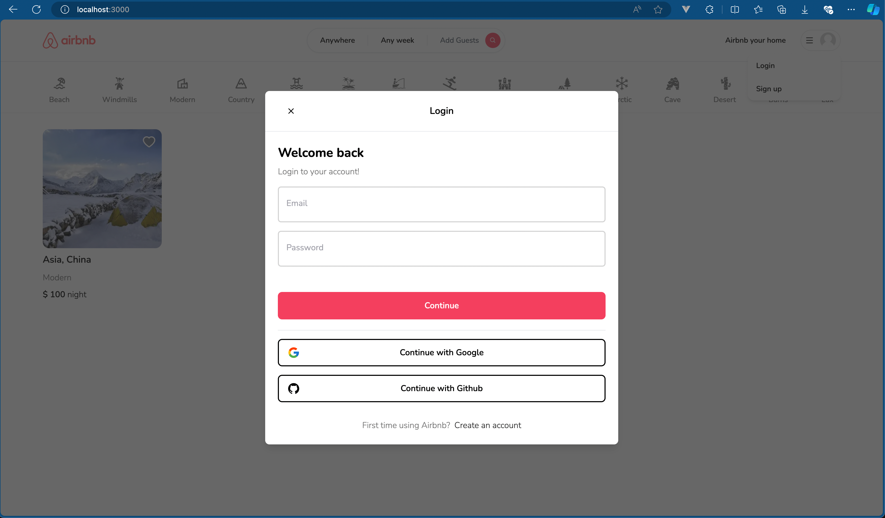
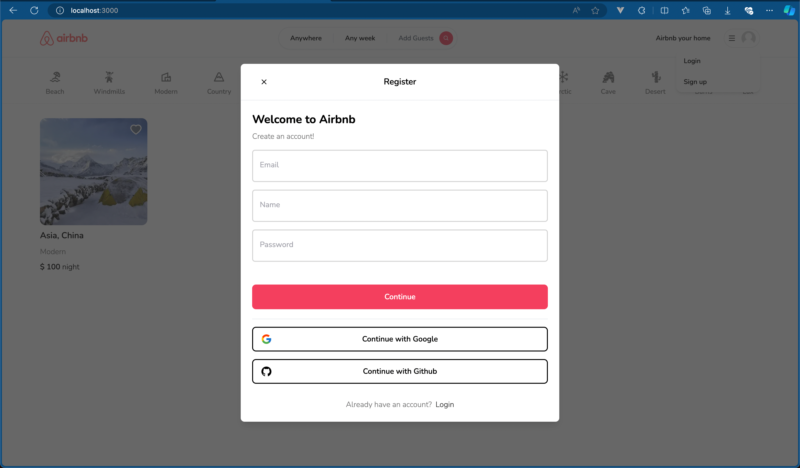
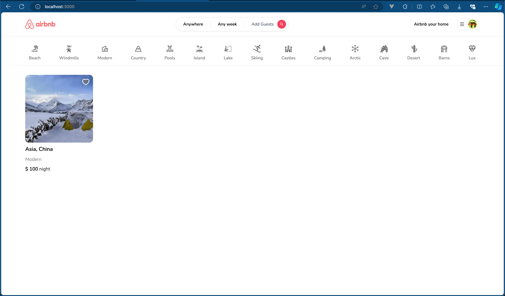
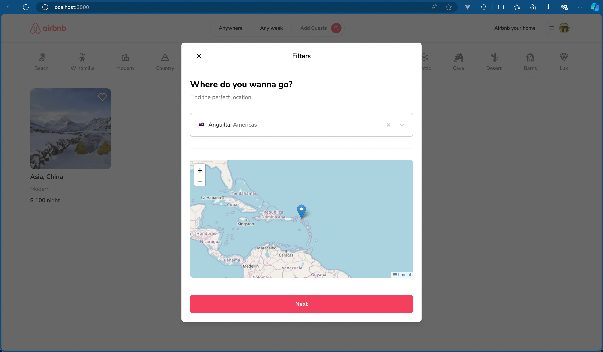
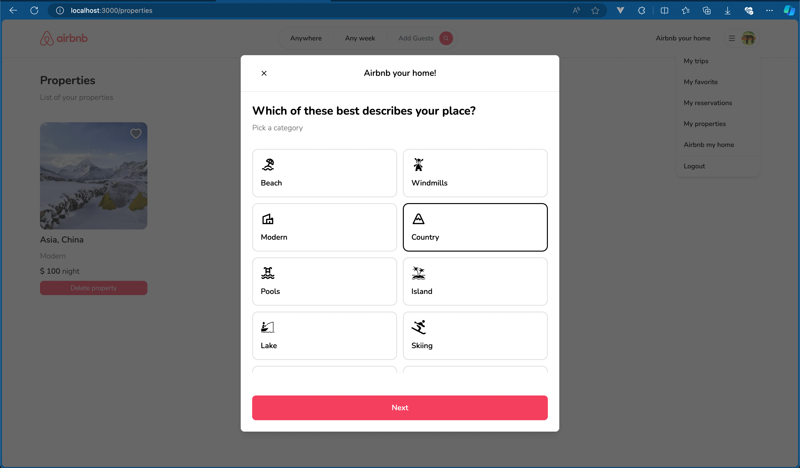
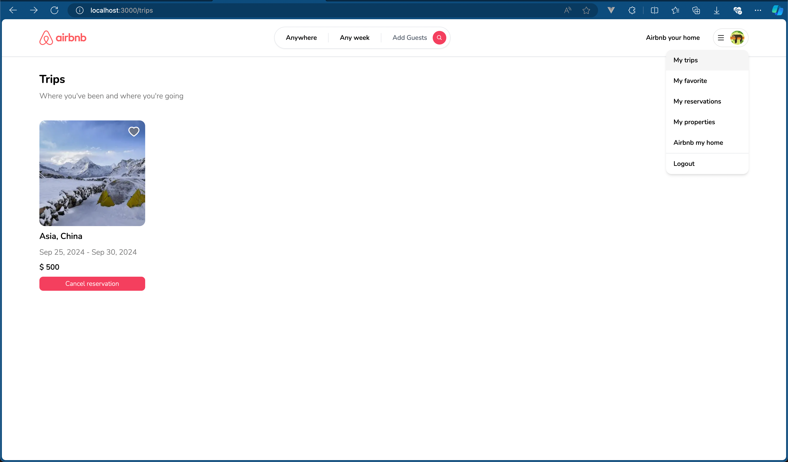
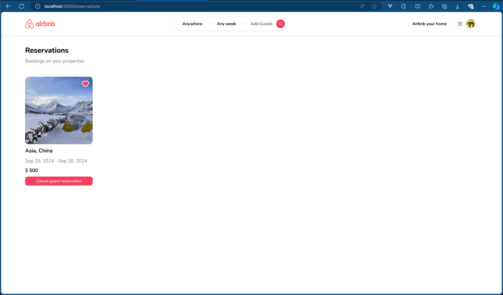
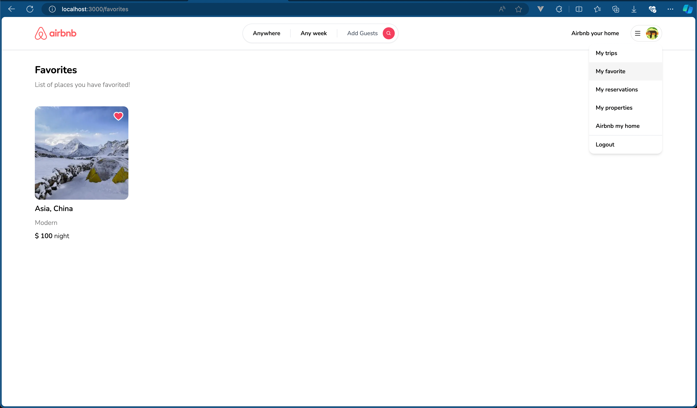

# Airbnb Clone

### Table of contents

- [Background](#background-thought_balloon)
- [Screenshot](#screenshot)
  - [Login modal](#login-modal)
  - [Signup modal](#signup-modal)
  - [Home page](#home-page)
  - [Listing detail page](#listing-detail-page)
  - [Filter listing modals](#filter-listing-modals)
  - [Register property modals](#register-property-modals)
  - [My trip page](#my-trip-page)
  - [My reservations page](#my-reservations-page)
  - [My favorites page](#my-favorites-page)
  - [My properties page](#my-properties-page)
- [Getting Started](#getting-started)
- [Learn more](#learn-more)
- [Deploy on Vercel](#deploy-on-vercel)

### Background

This repository is made to follow the tutorial from :clap: [Code With Antonio - Full Stack Airbnb Clone with Next.js 13 App Router: React, Tailwind, Prisma, MongoDB, NextAuth 2023
](https://youtu.be/c_-b_isI4vg?si=G6Ga16xK0bpCwkn5) youtube video.

:battery: Tech stack:

- Next.js 14
- Cloudinary
- Mongodb
- prisma
- tailwindcss
- leaflet
- next-auth
- zustand

## Screenshot

#### Login modal



#### Signup modal



#### Home page



#### Listing detail page

.png>)

.png>)

#### Filter listing modals



#### Register property modals



#### My trip page



#### My reservations page



#### My favorites page



#### My properties page


This is a [Next.js](https://nextjs.org/) project bootstrapped with [`create-next-app`](https://github.com/vercel/next.js/tree/canary/packages/create-next-app).

## Getting Started

1. Clone this repository

```bash
git clone git@github.com:nathanaelsanilo/airbnb-clone.git
```

2. Copy `.env` and rename it to `.env.local`

```
# MONGO SECRET
DATABASE_URL=""
NEXTAUTH_SECRET=""

# GITHUB SECRET
GITHUB_ID=
GITHUB_SECRET=

# GOOGLE SECRET
GOOGLE_CLIENT_ID=
GOOGLE_CLIENT_SECRET=

# CLOUDINARY
NEXT_PUBLIC_CLOUDINARY_CLOUD_NAME=
```

3. Install dependencies

```bash
pnpm install
```

4. Run the development server:

```bash
npm run dev
# or
yarn dev
# or
pnpm dev
# or
bun dev
```

Open [http://localhost:3000](http://localhost:3000) with your browser to see the result.

You can start editing the page by modifying `app/page.tsx`. The page auto-updates as you edit the file.

This project uses [`next/font`](https://nextjs.org/docs/basic-features/font-optimization) to automatically optimize and load Inter, a custom Google Font.

## Learn More

To learn more about Next.js, take a look at the following resources:

- [Next.js Documentation](https://nextjs.org/docs) - learn about Next.js features and API.
- [Learn Next.js](https://nextjs.org/learn) - an interactive Next.js tutorial.

You can check out [the Next.js GitHub repository](https://github.com/vercel/next.js/) - your feedback and contributions are welcome!

## Deploy on Vercel

The easiest way to deploy your Next.js app is to use the [Vercel Platform](https://vercel.com/new?utm_medium=default-template&filter=next.js&utm_source=create-next-app&utm_campaign=create-next-app-readme) from the creators of Next.js.

Check out our [Next.js deployment documentation](https://nextjs.org/docs/deployment) for more details.
